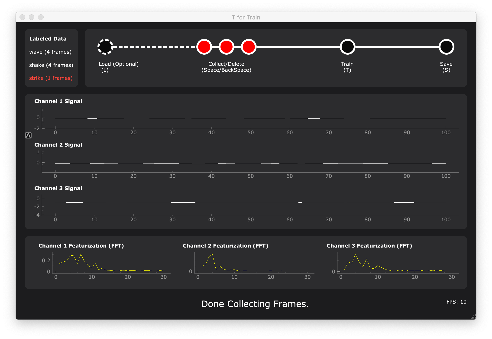

---

## Contents

- [Overview](#Overview)
- [Data Handlers in T4Trian](#Different-Data-Handlers-in-T4Trian)
<!-- - [Videos](#Videos) -->
- [Setup](#Setup)
- [Dependencies](#Dependencies)
- [Interface](#Interface)
- [Running T4Train](#Running-T4Train)
  - [Configurations](#Configurations)
  - [Labels](#Labels)
  - [Controls](#Controls)
    - [Up/Down for Label Selection](#Up/Down-for-Label-Selection)
    - [L for Load](#L-for-Load)
    - [Space for Collect](#Space-for-Collect)
    - [Backspace for Delete](#Backspace-for-Delete)
    - [T for Train](#T-for-Train)
    - [S for Save](#S-for-Save)
    - [M for Machine Learning](#M-for-Machine-Learning)
    - [C for Confusion](#C-for-Confusion)
    - [I for Importance](#I-for-Importance)
    - [Featurization](#Featurization)
- [Visualizations](#Visualizations)
- [Data Sources / Devices](#Data-Sources)
- [Machine Learning](#Machine-Learning)
- [Publications](#Publications)
- [Contribute](#Contribute)
- [Troubleshooting](#Troubleshooting)

## Overview

[T4Train](https://github.com/t4train/t4train) is an open-source, real-time, cross-platform GUI that collects, visualizes, and
classifies real-time data streams for interactive applications.

- **_Easy-to-use_**: _ML-driven interactive applications prototyped and deployed rapidly_
- **_Cross-platform_**: _Mac, Linux, and Windows supported_
- **_Real-time visualizations_**: _Raw signals and featurized data plotted in real time_
- **_Open source_**: _Framework fully extendable and customizable_

## Different Data Handlers in T4Trian

We currently support 7 data handlers: built-in laptop camera, Teensy, Arduino,
built-in laptop microphone, microphone that saves audio stream in .wav format,
iOS mobile app with UDP connection (gyroscope and accelerometer), and iOS mobile app with
BLE (Bluetooth) connection (gyroscope and accelerometer).

Mac, Linux, and Windows are all supported.

|                    Teensy                     |               Microphone                |                    Camera                     |                  iOS Mobile                   |
| :-------------------------------------------: | :-------------------------------------: | :-------------------------------------------: | :-------------------------------------------: |
|  |  |  |  |
|  |  |  |  |

| []()                          | Windows | macOS | Linux | Raspberry Pi |
| :---------------------------- | :-----: | :---: | :---: | :----------: |
| [iOS](#iOS-Data-Source)       |   ✅    |  ✅   |  ✅   |      ✅      |
| [Teensy](#Teensy-Data-Source) |   ✅    |  ✅   |  ✅   |      ✅      |
| [Microphone](#microphone)     |   ✅    |  ✅   |  ✅   |      ✅      |
| [Camera](#Camera)             |   ✅    |  ✅   |  ✅   |      ✅      |

## Setup

T4Train requires Python 3 and several dependencies listed in `requirements.txt`.
Follow [setup-README.md](readme_assets/setup-README.md) for setup instructions
for your computer.

After you've installed your dependencies, go back to the [steps](#Running_T4Train) on
how to get T4Train running.

## Interface

_ui.py_ uses Python's PyQt5 library to create the interface. The following is a screenshot of the interface with a configuration featuring the labels "wave," "shake," and "strike," 3 accelerometer input channels, and FFT data featurization:



- **Top left corner box:** a list of training labels and the number of data frames collected for each label. The label highlighted in red indicates the "current" label, for which recorded data frames are annotated. Users can arbitrarily switch between labels using the keyboard's arrow keys to collect new frames using spacebar or delete collected frames using backspace as described in a later section. We make these design choices to improve system status visibility and offer better user control in collecting data per label.

- **Top right box:** a step progress bar, which visualizes a training pipeline's necessary steps. On the far left, the user sees the optional step of loading pre-recorded data from a file. To its right is a completion node for each of the training labels, suggesting that one can only proceed to the training step once each label has at least one frame of annotated data. Once the user completes a step, the corresponding node is highlighted in red to indicate its completion status. Following the data collection steps is a completion node suggesting to hit "T" to train, and node to hit "S" to save the resulting ML model and training data. The step progress bar serves as a guide for beginners and can help users diagnose issues with T4Train (e.g., the model cannot train unless the label nodes are filled). The progress bar can be hidden via the application menu if the user no longer needs it.

- **Below the label selector:** real-time plots of each channel's raw signal data, provided by the data handler child process. Since users are given the option to featurize data, the UI provides an additional set of horizontally ordered plots for each channel's featurized signals. Users can toggle between different application menu features to find a featurization method that suits their use case. Since features, rather than raw signals, are what the machine learning trains on, the user must be able to see the relationship between signals and features and know precisely what the machine learning is receiving as input. By viewing the features in realtime, a user can toggle through the feature options to select an optimal schema. For example, if a user notices frequency changes in the raw signal, they may prefer extracting FFT or derivative features from the data. For the camera data handler, the default behavior displays the camera frames, the generated keypoints, and hand skeleton are presented below the plots.

- **Footer:** a message board that relays system status updates to the user, such as whether data is being collected or the current prediction of a generated ML model. It can be easily extended to express other system status messages. The lower right corner is an FPS counter that relays the data stream's speed, useful for debugging custom hardware or sensors. At the very top of the interface is the context menu, which includes all the commands found via keyboard shortcuts, featurization and ML settings, and options to modify the UI, such as increase or decrease font size.

### Running T4Train

After installing all of the general dependencies and dependencies for your chosen
data handler, run the following in T4Train's root directory to
start the T4Train program:

```
$ python ui.py
```

### Configurations

_config.ini_ is the config file that _ui.py_ parses to determine the different
labels, channels, machine learning algorithm, data source, sampling rate, frame length,
and number of bins you will be training.

#### Labels

To change the labels, replace the list of labels in the _LABELS_ section of
_config.ini_. For example, if you want your labels to be _fist_, _open_, and
_thumbs up_, your _LABELS_ field in your _config.ini_ should look like this:

```
[GLOBAL]
LABELS: [fist, open, thumbs up]
```

#### Channels

To change the number of channels of waves you want to plot on the interface,
replace the _CHANNELS_ field in your _config.ini_. For example, if you
want to display three channels, your _CHANNELS_ section in your _config.ini_
should look like this:

```
[GLOBAL]
CHANNELS: 3
```

Microphone currently only supports 2 channels.

#### Machine Learning Algorithm

To change the machine learning algorithm you want to use during training and predicting,
change the index of the algorithm in the _config.ini_ (zero indexed).

```
[GLOBAL]
CURR_ALGO_INDEX: 3
```

#### Data Source

To change the data handler file you want to use as a data source,
change the index of the data handler in the _config.ini_ (zero indexed).

```
[DS]
DS_FILE_NUM    : 3
```

#### Sampling Rate, Frame Length, Number of Bins

For mobile data sources ONLY, you can change the sampling rate and frame length in
_config.ini_:

```
[GLOBAL]
FRAME_LENGTH   : 3000

[DS]
SAMPLE_RATE   : 50

[ML]
NUM_BINS  : 750
```

The sampling rate, frame length, and number of bins are hardcoded into other data source files to optimize
the ML and UI, so changing these fields for Microphone or Teensy will not impact either.

### Controls

To use the interface, there are several different controls:

- [Up/Down for Label Selection](#Labels)
- [L for Load](#L_for_Load)
- [Space for Collect](#Space_for_Collect)
- [Backspace for Delete](#Backspace_for_Delete)
- [T for Train](#T_for_Train)
- [S for Save](#S_for_Save)
- [M for Machine Learning](#M_for_Machine_Learning)
- [C for Confusion](#C_for_Confusion)
- [I for Importance](#I_for_Importance)
- [Featurization](#Featurization)

#### Up/Down for Label Selection

_ui_labels.py_ is a class that manages the labels from _config.ini_.

To select a different label, the user can use the up/down arrow keys. On
_down_, _ui.py_ will call _move_down_ to highlight the label below the current
selected label. Similarly, _move_up_ will be called on _up_.

    def move_down(self):
        """Moves selected label to one below."""

    def move_up(self):
        """Moves selected label to one below."""

#### L for Load

If you have previously used T4Train and saved your training data files
and/or the model file, you can place the files in _saved_files/import/_ in the
project directory. You can then press **_l_**, which will copy all the files in
_saved_files/import/_ and paste them in the project directory.

By loading past files, you can continue your session and collect more training
data, delete some data, retrain, or save again.

You can also load data with the application menu in the PyQt UI under the "Commands" tab.

#### Space for Collect

Hit **_spacebar_** to collect the next _number of instances_ of frames of data
(_number of instances_ can be changed in the _config.ini_ file). The data will be saved
using numpy's save function to a file in the project directory with the name
_trainingdata[label].npy_, _[label]_ being the current selected label.
If the file already exists, the data will be appended to the file.

Each collection will be in a numpy ndarray of the shape (_frames_, _channels_,
1502), where _frames_ is the number of frames collected (default is 10) and
_channels_ is the number of channels specified in _config.ini_.

You can also collect frames with the application menu in the PyQt UI under the "Commands" tab.

#### Backspace for Delete

Hit _backspace_ to delete the most recent _number of instances_ frames of data for the selected
label (_number of instances_ can be changed in the _config.ini_ file). The data will be deleted from the file in the project directory with
the name _trainingdata[label].npy_, _[label]_ being the current selected
label. If the file does not exist (there are no saved data for the selected
label), then nothing will happen.

You can also delete frames with the application menu in the PyQt UI under the "Commands" tab.

#### T for Train

Hit **_t_** to send a signal to _ml.py_. _ml.py_ will then train a model on _.npy_
files with the format _trainingdata[label]_ with _[label]_ being the label name.

After training, _ml.py_ will continuously read _tmpframe.npy_ and predict its
label. The prediction will be written to _prediction.npy_.

In the meantime, _ui.py_ will continuously read _prediction.npy_ and display
the prediction onto the interface.

More specifically, when you hit **_t_**, the UI will append all the training data
into one file called _training_data.npy_. In addition to this, the UI will also
create a file called _training_labels.npy_, which is a list of labels for each
collection of training data.

For example, if the labels are `[touch, no touch, wiimote]` and you collect
10 frames for each label, the training data files will be
_training_data_touch.npy_, _training_data_no_touch.npy_, and
_training_data_wiimote.npy_. When you hit **_t_** to train, the UI will create
_training_data.npy_, which will be all the training data (30 frames). Since
there are three groups of 10 frames, the UI will also create
_training_labels.npy_, which will be the labels in a list
`([touch, no touch, wiimote])`, in the same order that they are in
_training_data.npy_.

The ML will then take these two files to train a classification model. After
training, the ML will spit the current frame's prediction to _prediction.npy_,
which will be projected onto the UI.

The following three functions are located in _utils.py_ and
prep the input files for the ML.

    def get_training_data_files_and_labels(labels_raw_text):
        """Gets all training data file names and its sanitized labels."""

    def write_training_labels(training_data_files, labels, filename):
        """Write npy file of labels (input for ML)."""

    def compile_all_training_data(training_data_files, filename):
        """Compiles all training data files into one file (input for ML)."""

The UI will call these functions in _prepare_ml_input_files()_.

    def prepare_ml_input_files(self):
        """Create training_data.npy and training_labels.npy for training."""

You can also train with the application menu in the PyQt UI under the "Commands" tab.

#### S for Save

Hit **_s_** to copy all _training*data*[label].npy_ files and send a signal to
_ml.py_, which will save the model (if it exists) as _model.npy_. These files
will be placed in _saved*files/%YYYY*%MM*%DD-%HH*%MM/_.

You can also save with the application menu in the PyQt UI under the "Commands" tab.

#### M for Machine Learning

Hit **_m_** to toggle between machine learning models to use in _ml.py_. The footer
of the UI will display which to algorithm you have toggled.

You can toggle between to SVM ('svm'), Random Forest ('rf'), Neural Net ('mlp'), or a
voting classifier ('voting').

You can also toggle between the algorithms with the application menu in the PyQt UI
under the "ML Algorithm" tab, and you can instantly boot-up T4Train with a certain
algorithm if you change the current algorithm index in the [_config.ini_ file](#Configurations).

**\*Note:** if you toggle to a different model after training, the current model will be erased.
[Save](#S_for_Save) your model before you toggle if you want to keep your model.\*

#### C for Confusion

Hit **_c_** to generate a [confusion matrix](https://en.wikipedia.org/wiki/Confusion_matrix)
in _confusion_matrix.csv_. This calls the following function in _ml.py_:

    def confusion_matrix():
        """Generates a confusion matrix from the training data"""

This function will call scikit learn's K-folds cross validation to split the
training data into 10 different train/test splits. Then, from each fold, _ml.py_ will generate
a model on the training data, classify on the test data, find the accuracy of the classification,
and generate a confusion matrix using
[scikit learn's confusion matrix](https://scikit-learn.org/stable/modules/generated/sklearn.metrics.confusion_matrix.html)
function.

               # of Predicted Result
                 A       B       C
      # of   A  ___     ___     ___
     Actual  B  ___     ___     ___
     Result  C  ___     ___     ___

You can aso generate a confusion matrix with the application menu in the PyQt UI
under the "Commands" tab.

#### I for Importance

Hit **_i_** to generate feature importances in _feature_importances.csv_. This calls
the following function in _ml.py_:

    def feature_importances():
        """""Generates a confusion matrix from a random forest"""

The function trains a random forest classifier on the training data and returns the
feature importances from that model.

You can also generate feature importances with the application menu in the PyQt UI
under the "Commands" tab.

#### Featurization

The application menu in the PyQt UI has featurization options under the "Featurization" tab.
The available featurizations change depending on the data source. Featurization calls the following
function in _utils.py_:

    def featurize(input_frame, featurization_type=Featurization.Raw, numbins=60, sample_rate=None):
        """Featurizes data using the enum Featurization class in utils"""

This function bins the data into the number of bins specified in _config.ini_ (for mobile only,
fixed for other data sources), then applies the selected featurization method onto the binned data.
Ths function featurizes the data on the ML side in _ml.py_, but also in the UI featurized plots in
_ui.py_.

**\*IMPORTANT NOTE:** **DO NOT** featurize the data you collect differently from the data the program
predicts from. This means that the featurization method should stay the same while collecting data
and after hitting **t** to train.\*

## Visualizations

For all data sources, the raw signals of each channel are plotted on top in real time, then
the featurized plots visualizing the featurized data for each channel are plotted below the raw signals.

For camera, in addition to the raw and featurized plots, the camera's live frames are displayed in the UI,
along with keypoints. This video window can be resized by adjusting the edges with your mouse in the UI.

## Data Sources

### iOS Data Source

To use the iOS T4T app for streaming sensor data, you'll need to install Xcode from the
Mac App store, and an iOS device running iOS 12.0 or later. Currently supported sensors
include the accelerometer and gyroscope, with hardware-capped sample rates of 100 Hz each.

Follow [iOS-README.md](readme_assets/iOS-README.md) for setup instructions.

### Teensy Data Source

The teensy data handler receives data via serial from a teensy, reshapes the
data by channels, and hands a complete data frame to T4Train. This data
handler compared to the Arduino data handler, is optimized to maximize the
data throughput for the Teensy 3.6 and Teensy 4.0. **ADD**

### Microphone

Microphone uses the built-in laptop microphone and python package PyAudio to
stream audio data.

It is recommended to collect at at least 3-4 times for each label (spacebar) and to
start making sound before and continue a little after you collect for training.

Copy the `config_mic.ini` setup into `config.ini` to run T4Train. Both `config_mic.ini`
and the top of `ds_microphone.py` detail the `config.ini` setup necessary
to run T4Train with microphone.

Configuration notes:

- Increasing `INSTANCES` increases data collection time every time you press the
  spacebar.
- Increasing `FRAME_LENGTH` increases FFT resolution but decreases UI plotting speed.
- You can find your microphone's sampling rate in your laptop's sound settings and
  adjust accordingly in `SAMPLE_RATE`. Most laptop microphones are either 44,100Hz or 48,000Hz.
  Data collection will not be accurate if the rate is wrong.
- `NUM_BINS` for FFT featurization **must be between 1 and `FRAME_LENGTH / 2`** (inclusive) and must
  be between 1 and `FRAME_LENGTH` for raw featurization (inclusive).
- Increasing `NUM_BINS` increases data resolution but also increases ML fragility. Reduce
  `NUM_BINS` to increase ML robustness.

For exterior microphones that stream audio by saving data in `.wav` files
on your laptop, use the Microphone config.ini setup, but change the folder in `ds_microphonewav.py`
and change the `DS_FILE_NUM` to `4`.

### Camera

The camera data handler streams visual data from the webcam, processes the camera frames using OpenCV and MediaPipe (implemented in TensorFlow), and generates hand keypoints to perform hand gesture recognition tasks. Camera frames with keypoints data are also passed to the UI for visualization.

For the camera data handler, only raw data and the featurization of deltas are available.

Copy the `config_cam.ini` setup into `config.ini` to run T4Train. `NUM_BINS` is not used in the camera data and can be ignored.

If the device has a CUDA-enabled GPU, `tensorflow-gpu` can accelerate the keypoint detection.

## Machine Learning

If you have questions about the specifics, email Foo at foo@bar.edu.

<!-- ## Publications Update this header upon hopeful citations -->

## Contribute

Feel free to fork the repo and submit GitHub issues for changes, feature requests, or bug fixes.

- Source Code: [github.com/t4train/t4train](github.com/t4train/t4train)

## Troubleshooting

### The UI won't start.

If you see an error message in terminal about the program not being able to find `ml_pidnum.txt`
or something like this, kill the program by pressing ctrl+c/cmd+c in terminal, then keep trying
to [restart the UI](#Running_T4Train). This will happen because sometimes the processes do not
start fast enough.

### The UI has started but it does not plot anything.

For Teensy or Arduino, if you are restarting the UI, sometimes the Teensy falls into an undefined
state. Kill the UI (either by closing the UI window or press ctrl+c/cmd+c)
and then unplug and replug the Teensy/Arduino.

For Microphone/Microphone WAV, make sure that your microphone is on in your computer's settings.

For Mobile UDP, make sure that the IP address is correct.

### T4Train stuck in "Training..." mode after I press "T".

Since Windows does not support signals, we use [timeloop](https://pypi.org/project/timeloop/)
to run T4Train on Windows. As a result, sometimes T4Train gets stuck after you press **_t_**
and "Training..." is displayed in the UI footer. Try killing the UI (either by closing the UI
window or press ctrl+c/cmd+c) and [restarting the UI](#Running_T4Train).

### T4Train doesn't work! You lied to me! After hitting "T" it's not correctly classifying the object.

Try changing the [featurization method](#Featurization) in the UI application menu under the
"Featurization" tab. There are certain data sources that work better
with certain featurizations, such as Mobile and Microphone with FFT
(Fast Fourier Transform).

You can also try trying different algorithms by using our [algorithm toggle](#M_For_Machine_learning).
Results may vary.

<!-- **\*IMPORTANT NOTE:** Do not touch the mode in the code. :)\* -->

### T4Train still doesn't work even after I tried everything!

Windows does not support signals and sometimes may not work properly. To get around this, we've created an Ubuntu VM
that includes all of the packages needed to run T4Train. To run the VM, you need at least 4GB of RAM and 2 CPU
cores.

Please email Foo at foo@bar.edu if you want to go this route.

### Other Problems

If you are having issues, please let us know.
Feel free to email Bar at foo@bar.edu and/or Foo at bar@foo.edu.
