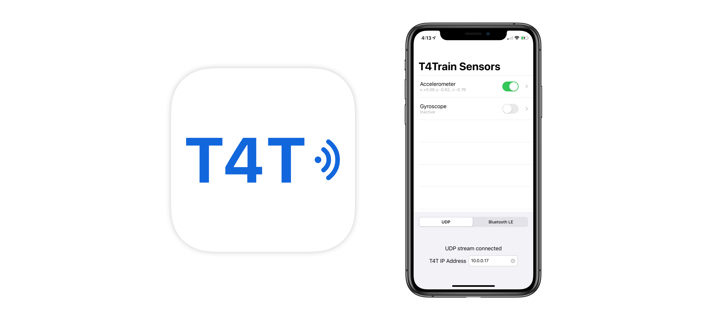
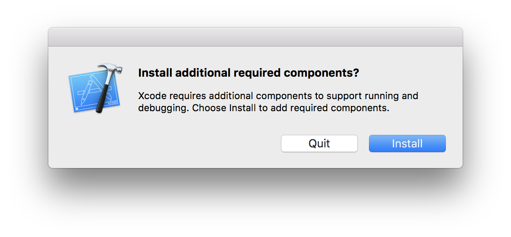
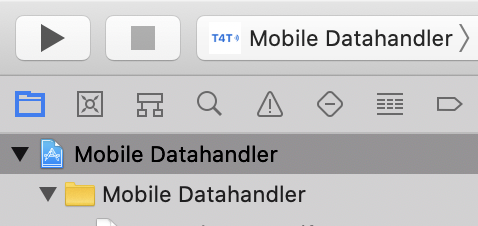
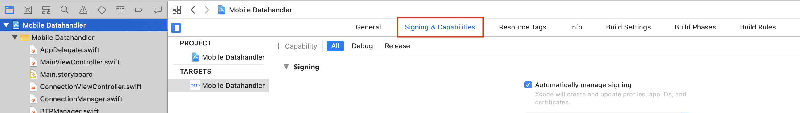
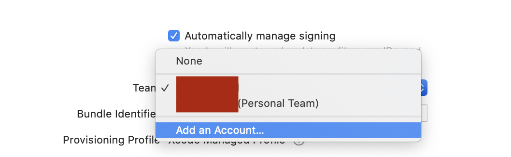
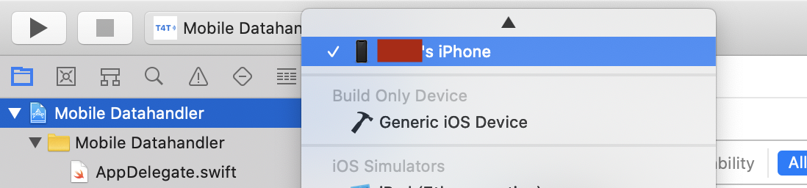
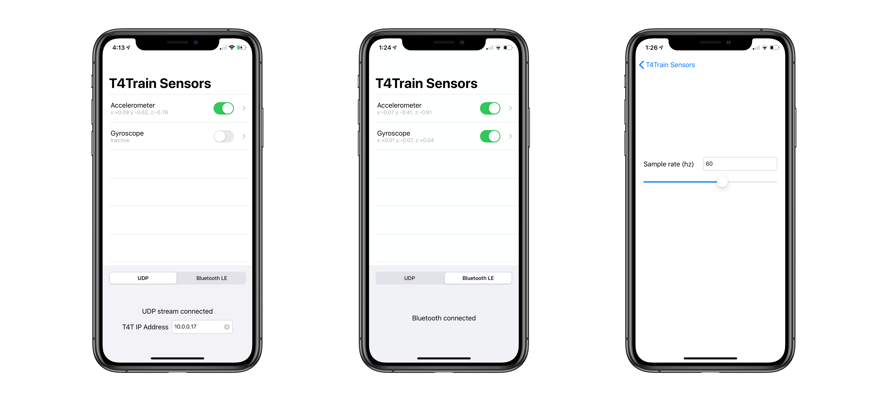

# Using iPhone sensors with T4T

## Contents

- [Overview](#Overview)
- [Requirements](#Requirements)
- [Xcode setup](#Xcode-Setup)
- [Interface](#Interface)
- [Currently available sensors](#Currently-available-sensors)
- [Adding new sensors](#Adding-new-sensors)
- [Troubleshooting](#Troubleshooting)

## Overview

Among T4Train's many pre-packaged data sources is the iOS data source mobile app, which allows
users to send signal data to the T4Train python script running on another devices via UDP (over a network)
or Bluetooth LE.

## Requirements

Xcode 11.0 and an iPhone, iPod Touch, or iPad with iOS 12.0 or above.

## Xcode Setup

In the repo's `Mobile App` directory, double click on the `Mobile Datahandler.xcodeproj` file to open the Xcode project. Plug your iOS device into your Mac via USB.

If you've already used Xcode to run an app on a physical device, simply change the Xcode app Target's team to one that you have previously registered with Apple. If you have never run an iOS app on a physical device with Xcode, follow the instructions outlined by Apple [here](https://developer.apple.com/documentation/xcode/running_your_app_in_the_simulator_or_on_a_device), or use following steps that should work for most versions of Xcode:

1. Download Xcode from the Mac App Store.
1. Launch Xcode, and click "Install" if asked to Install additional components.
   
1. In the repo's `Mobile App` directory, double click on the `Mobile Datahandler.xcodeproj` file to open the Xcode project. Plug your iOS device into your Mac via USB.
1. Ensure that the Project Navigator folder icon is selected in the left sidebar. If the left sidebar is not visible, use the toggle in the top-right corner of the Xcode window to open it.
   
1. Select the blue project workspace file.
1. In the menu bar that appears, click on "Signing and Capabilities" \_Note: on earlier versions of Xcode, the next step's settings panel is located under "General"
   
1. Enable "Automatically manage signing," click on the "Team" dropdown menu, and select "Add Account..."
   
1. Sign in with an existing Apple ID.
1. Select the newly added iCloud account in the dropdown menu used to add an account.
1. In the top left corner, select the target's run device to be the plugged in iOS device
   
1. Press the play button or cmd-R to run onto your device. You may need to unlock your device to continue, and your first run may take extra time to automatically configure the iPhone with permissions to work with Xcode.

## Interface

- The top half of the main screen lists all available sensors. Tapping the toggle on the right side of a sensor's cell will attempt to enable that sensor and request relevant usage permissions.
  - Each sensor's cell subtitle shows informational text describing recent sensor signal activity. Note that the refresh rate of this text may be lower than the actual sample rate of the data being sent to T4Train.
  - Relevant sensors should be enabled before T4Train is run on a laptop or desktop. This is to ensure that the buffered data sent to T4Train is consistent in length.
- Tapping on a sensor table cell will open the corresponding settings view controller.
  - For the two included sensors, these settings view controllers simply allow you to pick a sample rate between 1 Hz and 100 Hz (the hardware limit).
  - The lowest sample rate of the set of active sensors currently acts as the bottleneck for samples sent to T4Train. If you needd different behavior, modify `SensorBuffer.swift`.
- The bottom half of the main screen features a segment control for picking between UDP (network) and Bluetooth LE.
  - Since Bluetooth LE requires hardware not available on all computers, UDP is recommended.
  - A status label below the segment control indicates whether the iOS device was able to successfully form a network or Bluetooth connection to the provided IP or preset Bluetooth service UUID. **If you use UDP, check the IP address of the computer running T4Train, and enter it in the text field.**
  - Note that a "successful" connection does not imply that T4Train is running and receiving data. It simply means that the iOS device is capable of sending messages to the destination.

## Currently available sensors

The T4T mobile app currently supports sending accelerometer and gyroscope data.
These sensors are hardware-capped at a 100 Hz sample rate. New samples are buffered
by `SensorBuffer.swift`, which concatenates sensor data in a packet to be sent to T4Train.

## Adding new sensors

The mobile app's code is structured in a way that encourages the addition of new sensors,
such as the touch screen's pressure sensor. Follow these steps to display the option for another
sensor in the mobile app:

1. Write a Swift `UIViewController` subclass that conforms to the `DataHandler` protocol. 
    - Conforming to this protocol is sufficient for providing the interface for enabling, disabling, and updating the sample rate of sensors.
    - To allow your view controller to send samples over UDP or BLE, call `SensorBuffer.swift`'s `pushUpdate` when new a new sample is available, and `stopUpdates` when the view controller is told to disable its sensor.
1. In `MainViewController.swift`, update the `controllers` array of DataHandlers to include an instance of the new view controller you created in step 1. For a basic view controller with a UI built in the interface builder with a .xib file, constructing your view controller with the init(nibName...) initializer should suffice.

## Troubleshooting

Further questions can be directed at foo@bar.edu.
